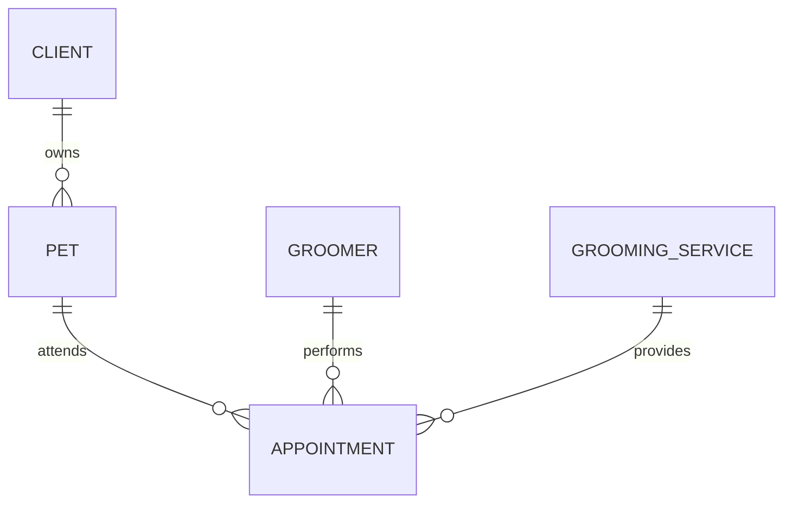

# Initial data model

An appointment stores its scheduled start time and its expected end time. The end time is calculated from the selected service duration when a booking is created or rescheduled.

